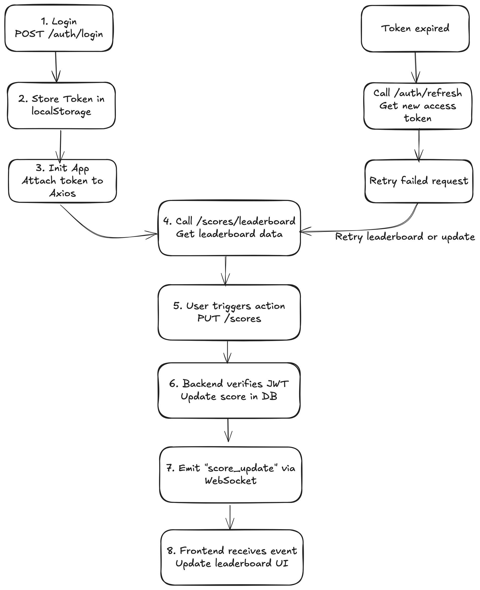

# 🏆 Backend – Score API Service

This is the backend module managing user scores with real-time updates and secure API interactions.

## ⚙️ Stack

- NestJS
- MongoDB
- WebSocket Gateway
- JWT Auth

## 🔧 Setup

1. Install:
```bash
pnpm install
```

2. Configure `env` file in folder `config/default.yaml`:
```YAML
port: 4000

cors:
  origins:
    - http://localhost:3000
    - https://staging.example.com
    - https://app.example.com
  credentials: false

mongodb:
  uri: mongodb://localhost:27017
  databaseName: api-score
  collections:
    users: users
    scores: scores
    migrations: migrations_changelog
  migration:
    path: src/migrations
    user:
      amount: 20

auth:
  salt: 10
  secret: this-is-my-secret
  accessTokenExpire: 15m
  refreshTokenExpire: 7d

logger:
  sensitives:
    - password
    - accessToken
    - refreshToken
    - req.headers.authorization
    - req.body.password
```
3. Run migration scripts. (check folder [src/migrations](../score-api/src/migrations))
```bash
pmpm run migrate:up

```
4. Start service:
```bash
npm run start:dev
```
# 📘 API Reference – Score Board System

## 🔐 Authentication Endpoints

### POST /auth/login
Authenticate user and return access and refresh tokens.

**Request Body:**
```json
{
  "username": "string",
  "password": "string"
}
```

**Response:**
```json
{
  "data": {
    "accessToken": "jwt-token",
    "refreshToken": "jwt-token"
  }
}
```

---

### POST /auth/logout
Invalidate current refresh token.

**Headers:**
```
Authorization: Bearer <accessToken>
```

**Response:**
```json
{
  "message": "Logged out"
}
```

---

### POST /auth/refresh
Refresh the access token using a valid refresh token.

**Request Body:**
```json
{
  "data": {
    "refreshToken": "jwt-token"
  }
}
```

**Response:**
```json
{
  "accessToken": "new-access-token"
}
```

---

## 🏆 Score Endpoints

### GET /scores/leaderboard
Get the top 10 users by score.

**Auth:** ✅ Requires JWT

**Headers:**
```
Authorization: Bearer <accessToken>
```

**Response:**
```json
{
  "data": [
    {
      "username": "user1",
      "fullName": "user1",
      "score": 95,
      "userId": "687bcc84579fb15ae758d52b"
    },
    {
      "username": "user18",
      "fullName": "user18",
      "score": 92,
      "userId": "687bcc84579fb15ae758d53c"
    },
    {
      "username": "user8",
      "fullName": "user8",
      "score": 91,
      "userId": "687bcc84579fb15ae758d532"
    },
    {
      "username": "user19",
      "fullName": "user19",
      "score": 90,
      "userId": "687bcc84579fb15ae758d53d"
    },
    {
      "username": "user16",
      "fullName": "user16",
      "score": 89,
      "userId": "687bcc84579fb15ae758d53a"
    },
    {
      "username": "user20",
      "fullName": "user20",
      "score": 87,
      "userId": "687bcc84579fb15ae758d53e"
    },
    {
      "username": "user4",
      "fullName": "user4",
      "score": 84,
      "userId": "687bcc84579fb15ae758d52e"
    },
    {
      "username": "user3",
      "fullName": "user3",
      "score": 77,
      "userId": "687bcc84579fb15ae758d52d"
    },
    {
      "username": "user12",
      "fullName": "user12",
      "score": 65,
      "userId": "687bcc84579fb15ae758d536"
    },
    {
      "username": "user9",
      "fullName": "user9",
      "score": 55,
      "userId": "687bcc84579fb15ae758d533"
    }
  ]
}
```

---

### GET /scores/rank
Get the current user's rank and score.

**Auth:** ✅ Requires JWT

**Headers:**
```
Authorization: Bearer <accessToken>
```

**Response:**
```json
{
  "data": {
    "userId": "687bcc84579fb15ae758d52b",
    "rank": 1,
    "score": 95
  }
}
```

---

### PUT /scores
Increase the score for the current user based on completing an action.

**Auth:** ✅ Requires JWT

**Headers:**
```
Authorization: Bearer <accessToken>
```

**Request Body:**
```json
{}
```

**Response:**
```json
{
  "message": "Updated score for user ${username} successfully"
}
```

---

## 🛡️ Notes

- All authenticated endpoints require a valid `Authorization` header.
- WebSocket pushes `score_update` event to all clients subscribed when score changes.
- Use `refreshToken` to avoid session expiration.

## 📡 Real-time Events

- `score_update` emitted to all WebSocket clients when scores are changed.


## 📊 Execution Flow
See the diagram in the repository:



## 💡 Suggested Improvements
- [ ] Add unit test and coverage 100%.
- [ ] Create file to store log data.
- [ ] Store historical score audit logs.
- [ ] Send notifications (email, WebSocket).
- [ ] Add rate-limiting to prevent abuse.
- [ ] Build an admin dashboard for insights.